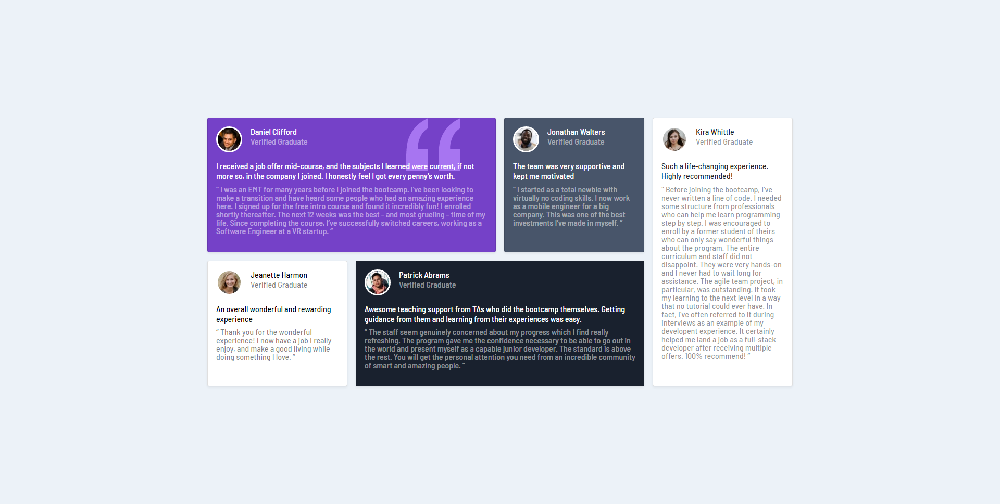

# Testimonial cards || Bootstrap 5, Sass

Mi primera practica con Bootstrap y Sass, una simple pagina web de testimonios, usando Node y PurgeCSS para acortar y optimizar las lineas de codigo de bootstrap.

- Pagina: [link](https://mi-primer-proyecto-bootstrap5-sass.netlify.app/)